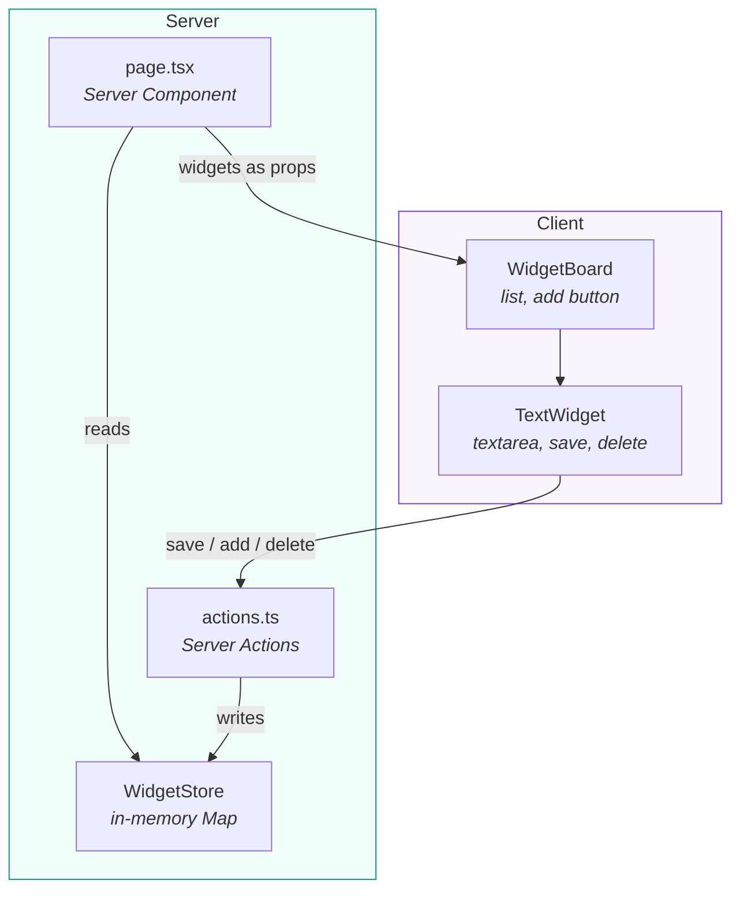
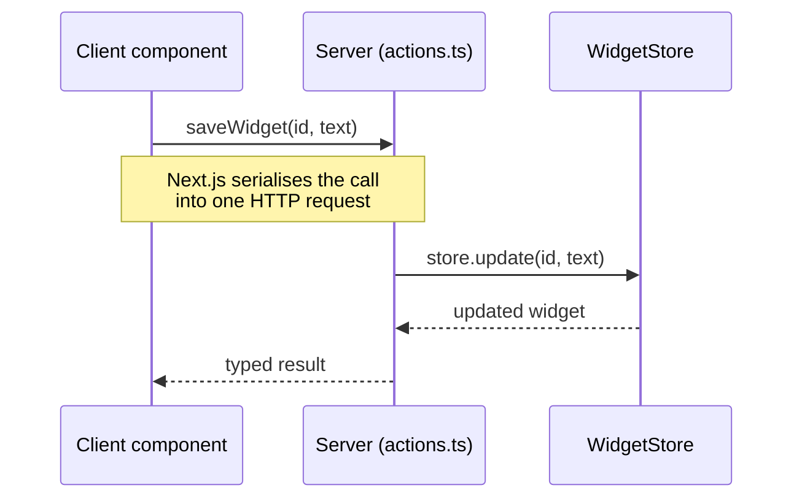
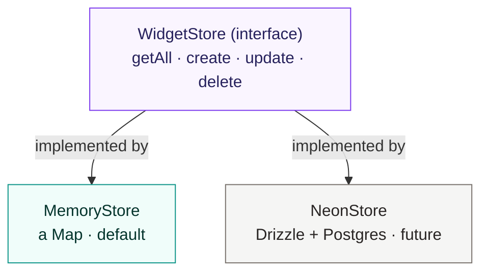

## Text Widgets

A web app where you can add multiple independent text widgets, type into each one, and have the content saved to the backend automatically. 

Text persists across page refreshes, and each widget is its own bordered, independent entity. Text is never shared between widgets. 

Widgets can also be deleted. 

Built with Next.js (App Router), Server Actions, as server-side store behind a swappable interface, debounced auto-save with validation, and a Vitest + React Testing Library suite.

https://github.com/user-attachments/assets/fc6464e0-e9bb-4582-b1e1-65217b45b36a

## Running the app

Requirements: Node.js18.18+ or 20+ and npm

# 1. Install dependencies
npm install

# 2. Start the dev server
npm run dev

Open http://localhost:3000

## Running the tests

# Run the full suite once
npm test

# Watch mode (re-runs on change)
npm run test:watch

## Contents 
- What it does
- Architecture overview
- Server Actions: what they are, how they work, the trade-off
- Storage: why no database
- How saving works (and why its performant)
- Validation
- Component design
- Testing
- Trade-offs and what I'd do with more time

## What it does 
- Add any number of text widgets with a button
- Each widget has its own text, typing in one does not affect another
- Text auto saves to the backend shortly after you stop typing
- Refreshing the page restores every widget with its saved text
- Widgets can be deleted
- A character counter and validation prevent over-long input from being saved

## Architecture Overview

The app has a clear split: reads happen on the server at load time; writes happen through Server Actions as you type.



**Read Path (on load)**
page.tsx is an async server component. It reads the store directly on the server and passed the widgets to the client as props. 

There is no client-side fetch on load, the data is already in the server rendered html.

**Write Path (as you type)**
The client calls Server Actions (saveWidget, addWidget, deleteWidget) which run on the server and update the store. 

## Project Structure
```
app/
  actions.ts        Server Actions — the client<->store boundary
  page.tsx          Server Component — reads the store, renders the board
components/
  WidgetBoard.tsx   Owns the widget list, the add button, add/delete coordination
  TextWidget.tsx    A single widget: textarea, save status, counter, delete
  ui/               shadcn/ui primitives (Button, Textarea)
hooks/
  useDebouncedSave.ts  Debounced save + redundant-save skipping
lib/
  store/
    types.ts        WidgetStore interface + Widget type
    memory-store.ts In-memory implementation (a Map)
    index.ts        Exports the active store (the swap point)
  validation.ts     Zod schema for widget text
```

  ## Server Actions

  **What are they?**

  A server action is a function marked with the "use server" directive, that only runs   on the server, but can be called directly from a client component as if it were a local async function. 

  Next.js handles the network round trip, no API route, no fetch, no manual JSON serialising. 

```
// app/actions.ts
"use server";

export async function saveWidget(id: string, text: string) {
  return store.update(id, text);   // runs on the server
}
```

```
// in a client component, called like a normal function
await saveWidget(widget.id, text);
```


**Why I chose them over API routes**
- I felt it was the right fit for the shape of this app, its a small client > server loop, not a public API
- No boiletplate, no app/api/.../route.ts files
- No client fetch wrappers
- No request / response plumbing
- End to end type safety, saveWidget returns a typed value, and the client gets that type

**The trade-off**
- Server actions are Next.js specefic. The convenience comes with framework lock in.
- For a product committed to Next.js, thats ok, but for something that needs a portable API, a dedicated API layer would be better

**Storage: why no database?**
- The brief permits in-memory storage as a tip, and required that text is sent to the backend and survives a page refresh.
- The store is built behind a small interface, with an in-memory implementation as default

```
  // lib/store/types.ts
export interface WidgetStore {
  getAll(): Promise<Widget[]>;
  create(): Promise<Widget>;
  update(id: string, text: string): Promise<Widget | null>;
  delete(id: string): Promise<boolean>;
}
  ```



Text is sent over the network to a Server Action and held in the server process, not in the browser, not in localStorage. 

**Why in memory?**
- The brief explicitly allows it, and it keeps the app runnable with zero setup, no db account, connection string, migrations etc

- A Map keyed by id gives 0(1) create / read / update / delete

**Memory Limitation**
- In memory state survives refreshes, but resets when the server restarts. The brief asked for survival across refresh, not restart. So I made a scope appropriate decision.

- ## How saving works
- I particularly lke how the UI feels instant while the backend is updated in the background. As a user, you will notice the saving whilst you stop typing is very seamless and fast.
  
- The textarea is a controlled React input, every keystroke updates local state and re-renders immediately.

**Saves are debounced**
- A save fires only after the user pauses (500ms), not on every keystroke
- Without this, typing a 100 character sentence, would mean 100 server round trips, with it a burst of typing collapses into a single request once the user stops

**Redundant saves are skipped**
- Before scheduling a save, the hook checks whether the text has actually changes from what was last saved. If you type and undo back to the saved value, or click into a widget and out without changing anything, no request is sent

**Reads don't over fetch**
- On load there is no client fetch and no per widget request, the server component reads everything once and the page is server rendered with the data already there.

## Validation
- Text is validated against a Zod schema enforcing a maximum lengh, with a limit as a single shared constant.

```
// lib/validation.ts
export const widgetSchema = z.object({
  text: z.string().max(MAX_WIDGET_LENGTH, { message: "..." }),
});
```
- A live character counter shows usage
- Validation runs in two places: on the client for instant feedback, and inside the saveWidget Server action as a gate. Client side checks are UX only, the server action is a network endpoint that can be called directly, so this check is for making sure invalid input doesn't reach the store.

## Component design 

Logic and presentation are kept seperate:
- useDebounceSave is a generic hook, deboune a save, it knows nothing about widgets or validation
- TextWidget is mostly presentational, it wires the hook and the zod check to a textarea, status indicator, counter and delete button
- WidgetBoard, owns the widget list and the add / delete coordination, each TextWidget owns its own text

This split keeps each piece small and independently testable, and means the board managing membership while widgets manage their own content is a clean division of responsibility.

## Testing
Three layers, each tested with the approach that suits it. Tooling: Vitest (runner), React Testing Library (component rendering via accessible queries), with the @/ alias mirrored in the Vitest config.

**Store**
lib/store/memory-store.test.ts

Pure logic, a fresh instance per test:

- create, getAll, update, delete
- returns null updating a missing widget, false deleting one
- persists an empty string (clearing a widget is a valid save)
- handles a large (1000+ character) string
- deleting one widget leaves others untouched (independence)

**Hook**
hooks/useDebouncedSave.test.ts

Fake timers to control the debounce:

- no save before the delay; one save after it
- rapid changes collapse into a single save
- no save when the value returns to the last saved value
- the typed value is preserved on the skip path

**Component**
components/TextWidget.test.tsx

Renders the real component, server actions mocked:

- renders initial text, updates and counts as you type
- saves valid text after the debounce
- over-limit text shows an error and is not saved
- delete calls both the action and the onDelete callback

## What I'd do with more time: 

- Also add a version of this project that has durable storage via the existing interface, would use Drizzle + Neon (learning these recently), data would survive restarts and deploys.
- Save failure handling, onSave currently assumes success; I'd handle the rejection path.
- Server-state sync. Local state is updated directly after mutations rather than revalidated; for multi-client/multi-view consistency I'd use revalidatePath or a client cache layer.


